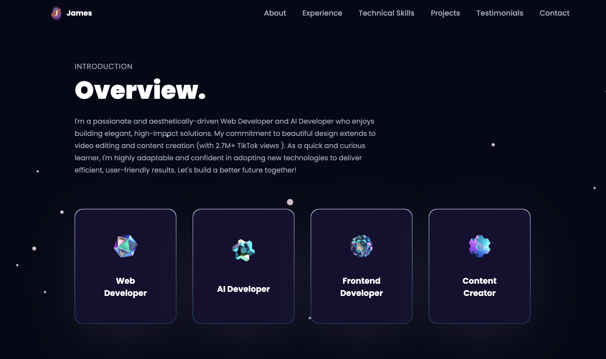

# 🚀 James William Hanzell - 3D Portfolio

A modern, interactive 3D portfolio website built with React, Three.js, and Framer Motion. Features immersive animations, physics-based interactions, and a sleek design to showcase my work and experience.



## ✨ Features

### 🎨 Interactive Sections
- **Hero Section**: Curved text marquee with interactive dragging and starfield background
- **About**: Animated service cards with tilt effects showcasing expertise areas
- **Experience**: Vertical timeline displaying professional journey
- **Technical Skills**: 3D floating technology balls with interactive rotation
- **Projects**: Tilt-enabled project cards with detailed descriptions and GitHub links
- **Testimonials**: Feedback cards from colleagues and peers
- **Contact**: Interactive contact form with 3D Earth globe visualization
- **End Section**: Physics-based falling text animation using Matter.js

### 🎭 Animations & Effects
- **Framer Motion**: Smooth page transitions and scroll-triggered animations
- **Three.js/React Three Fiber**: 3D models and interactive visualizations
- **Matter.js Physics**: Realistic gravity and collision effects
- **Particle Systems**: Dynamic starfield backgrounds
- **Curved Text Marquee**: Interactive draggable text with momentum

### 📱 Responsive Design
- Mobile-first approach with breakpoints for all screen sizes
- Adaptive layouts for tablets and desktop displays
- Touch-friendly interactions for mobile devices
- Hamburger menu for mobile navigation

## 🛠️ Tech Stack

### Frontend
- **React** - UI component library
- **Vite** - Fast build tool and dev server
- **Tailwind CSS** - Utility-first styling
- **Framer Motion** - Animation library
- **React Router** - Client-side routing

### 3D & Animations
- **Three.js** - 3D graphics library
- **React Three Fiber** - React renderer for Three.js
- **React Three Drei** - Useful helpers for R3F
- **Matter.js** - 2D physics engine

### Additional Libraries
- **EmailJS** - Contact form functionality
- **React Tilt** - Tilt effect for cards
- **React Vertical Timeline** - Timeline component
- **Maath** - Math utilities for animations

## 📦 Installation

### Prerequisites
- Node.js (v16 or higher)
- npm or yarn package manager

### Setup

1. **Clone the repository**
```bash
git clone https://github.com/Eternal128/Personal-Portfolio.git
cd Personal-Portfolio
```

2. **Install dependencies**
```bash
npm install
```

3. **Set up environment variables**
Create a `.env` file in the root directory:
```env
VITE_APP_EMAILJS_SERVICE_ID=your_service_id
VITE_APP_EMAILJS_TEMPLATE_ID=your_template_id
VITE_APP_EMAILJS_PUBLIC_KEY=your_public_key
```

4. **Run development server**
```bash
npm run dev
```

5. **Build for production**
```bash
npm run build
```

## 📁 Project Structure

```
src/
├── assets/          # Images, icons, and 3D models
├── components/      # React components
│   ├── canvas/      # 3D canvas components (Three.js)
│   ├── About.jsx
│   ├── Contact.jsx
│   ├── End.jsx
│   ├── Experience.jsx
│   ├── Feedbacks.jsx
│   ├── Hero.jsx
│   ├── Navbar.jsx
│   ├── Tech.jsx
│   └── Works.jsx
├── constants/       # Static data (projects, experience, etc.)
├── hoc/            # Higher-order components
├── utils/          # Utility functions and motion variants
├── styles.js       # Tailwind style configurations
├── App.jsx         # Main app component
└── main.jsx        # Entry point
```

## 🎯 Key Components

### Hero Section
- Custom curved text marquee with physics-based dragging
- Animated starfield background
- Interactive text that responds to mouse/touch

### 3D Tech Balls
- Interactive technology icons in 3D space
- Floating animation with rotation
- Decal mapping for logos

### Physics End Section
- Matter.js powered falling text
- Realistic gravity and collision detection
- Multiple words with individual physics bodies

### Contact Form
- Email integration with EmailJS
- 3D rotating Earth globe
- Form validation and loading states

## 🎨 Customization

### Update Personal Information
Edit `src/constants/index.js`:
- `navLinks` - Navigation menu items
- `services` - Service cards in About section
- `technologies` - Tech stack icons
- `experiences` - Work experience timeline
- `testimonials` - Testimonial cards
- `projects` - Project showcase cards

### Modify Colors
Tailwind color gradients are defined in `src/index.css`:
- `blue-text-gradient`
- `pink-text-gradient`
- `purple-blue-text-gradient`
- Custom gradients (ocean, sunset, neon, etc.)

### Change 3D Models
Replace GLTF files in `public/` directory:
- `desktop_pc/scene.gltf` - Computer model
- `planet/scene.gltf` - Earth model

## 📧 Contact Form Setup

1. Create an account at [EmailJS](https://www.emailjs.com/)
2. Create an email service
3. Create an email template
4. Copy your credentials to `.env` file

## 🚀 Deployment

### Vercel (Recommended)
```bash
npm run build
vercel --prod
```

### Netlify
```bash
npm run build
netlify deploy --prod
```

### GitHub Pages
```bash
npm run build
npm run deploy
```

## 📝 License

This project is open source and available under the [MIT License](LICENSE).

## 🤝 Contributing

Contributions, issues, and feature requests are welcome!

1. Fork the project
2. Create your feature branch (`git checkout -b feature/AmazingFeature`)
3. Commit your changes (`git commit -m 'Add some AmazingFeature'`)
4. Push to the branch (`git push origin feature/AmazingFeature`)
5. Open a Pull Request

## 📧 Contact

**James William Hanzell**
- Email: james.hanzell@mail.utoronto.ca
- LinkedIn: [Your LinkedIn](https://www.linkedin.com/in/james-william-hanzell/)
- GitHub: [@Eternal128](https://github.com/Eternal128)

## 🙏 Acknowledgments

- Three.js community for amazing 3D capabilities
- Framer Motion for smooth animations
- shadcn/ui for design inspiration
- All open source contributors

---

⭐ Star this repo if you found it helpful!

Built with 💙 by James William Hanzell
