# James William Hanzell — Personal Portfolio

A minimal, motion-driven portfolio and blog built with React. It opens on a drawn-box loader, then moves through a scrolling name marquee, a word-by-word intro, work experience, skills, a pinned project carousel, a blog with interactive posts, testimonials and a contact form. Everything is available in dark and light mode.

**Live site:** https://jameswilliamhanzell.vercel.app/

<p align="center">
  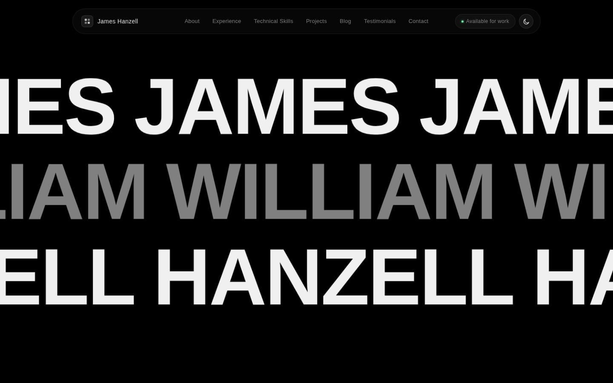
</p>

## 🖼️ Tour

### Loader
A square outline draws itself around the `JH` monogram while a counter runs from 0 to 100%. When it finishes, the box fills with the page colour and zooms out to fullscreen, handing off into the site.

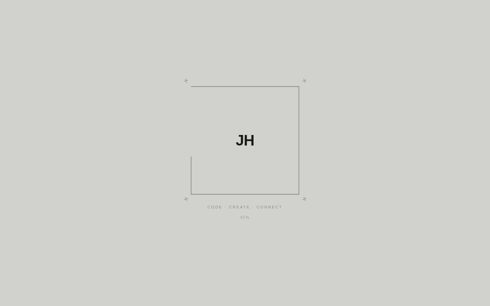

### Hero and About
The hero spells out **JAMES / WILLIAM / HANZELL** in three oversized marquee rows that scroll in alternating directions. The About section is pinned while you scroll, and its intro lights up word by word.

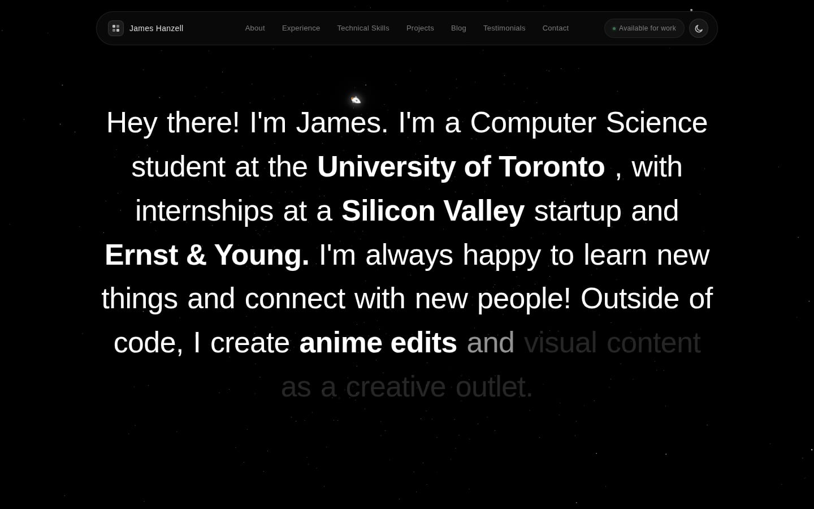

### Work Experience
Each company is a row with a **View role** link. It opens a full-screen role page with the key numbers highlighted. You can step between roles with the arrows (01 / 04).

<table>
  <tr>
    <td>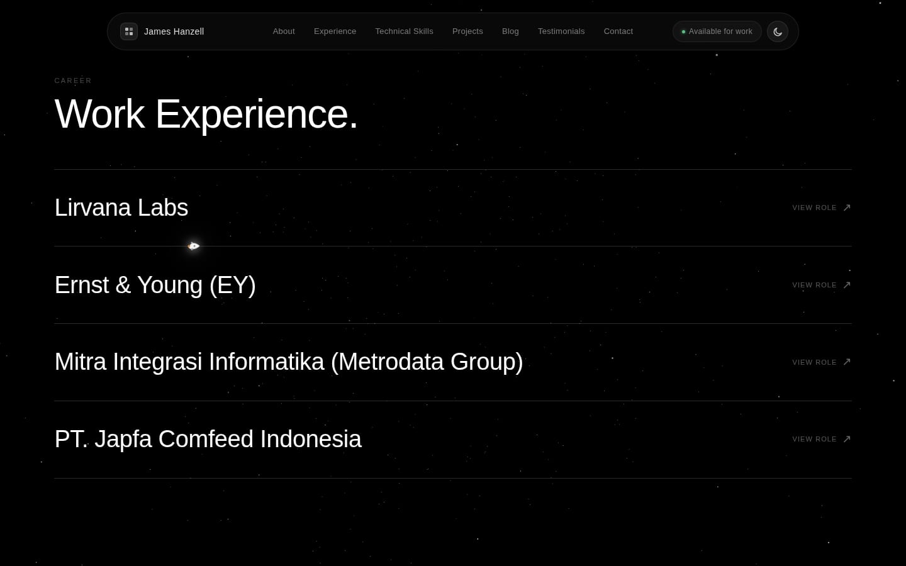</td>
    <td>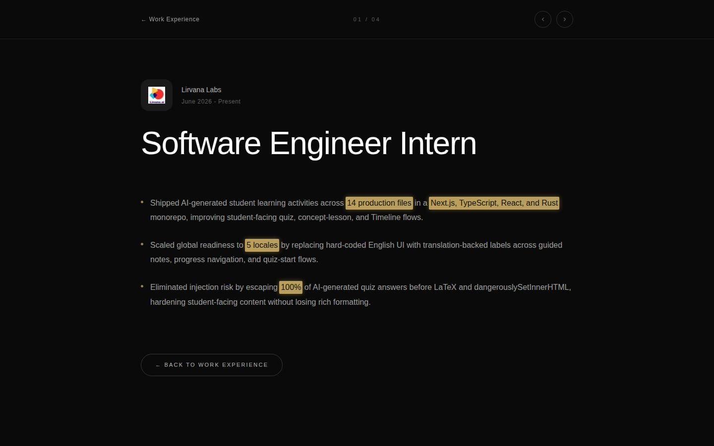</td>
  </tr>
</table>

### Technical Skills
A grid of skill cards, each with a proficiency level. Click a skill to see where it was used.

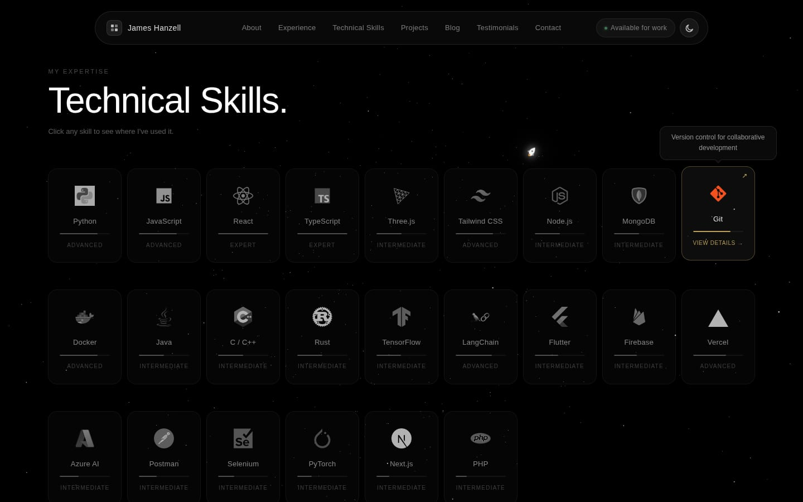

### Projects
A pinned, horizontally scrolling carousel of 10 projects with a counter, arrow controls and a clickable project index. Cards link to the GitHub source and live demos. They open a detail view with a problem / approach / outcome case study where one exists.

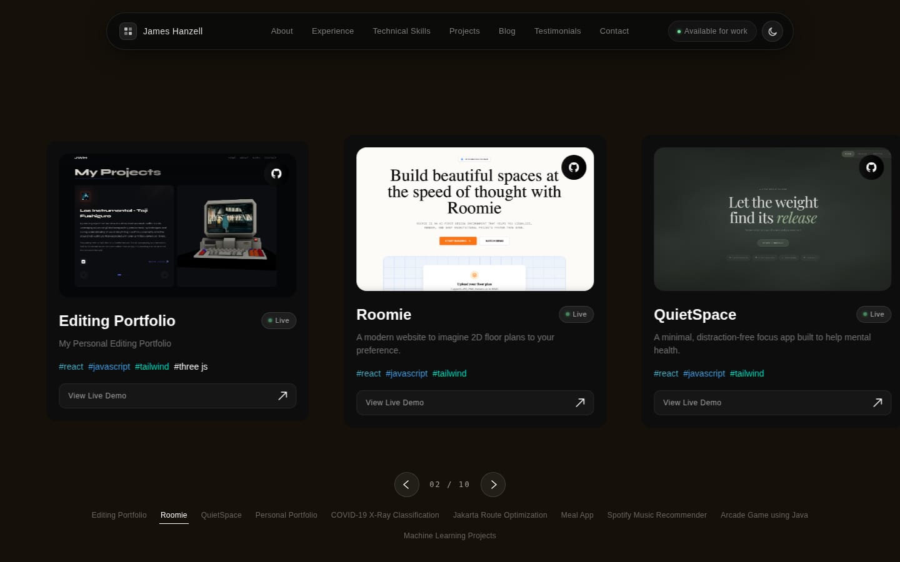

### Blog
The **Thoughts & process.** section previews the latest posts, and **See all posts** opens a full-screen blog. Posts have their own URLs (`#blog/<post-id>`), and several include interactive pieces:
- a 46-node Jakarta road network where you can run Dijkstra or Kruskal
- a neural network playground
- an easing playground
- a text generator
- a Messi shot map and heatmap

<table>
  <tr>
    <td>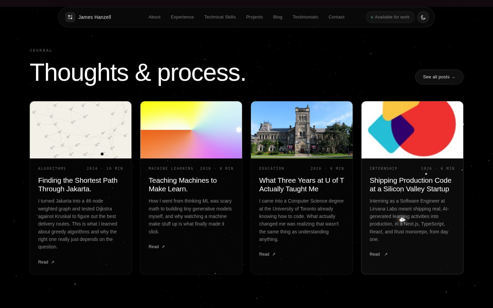</td>
    <td>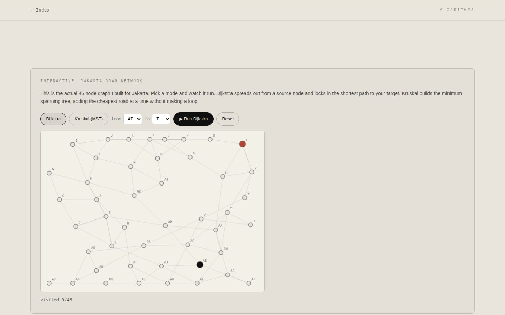</td>
  </tr>
</table>

### Testimonials and Contact
Testimonials sit in a horizontally scrolling row of cards. The contact section has a form that sends email through EmailJS, plus direct email, location and social links.

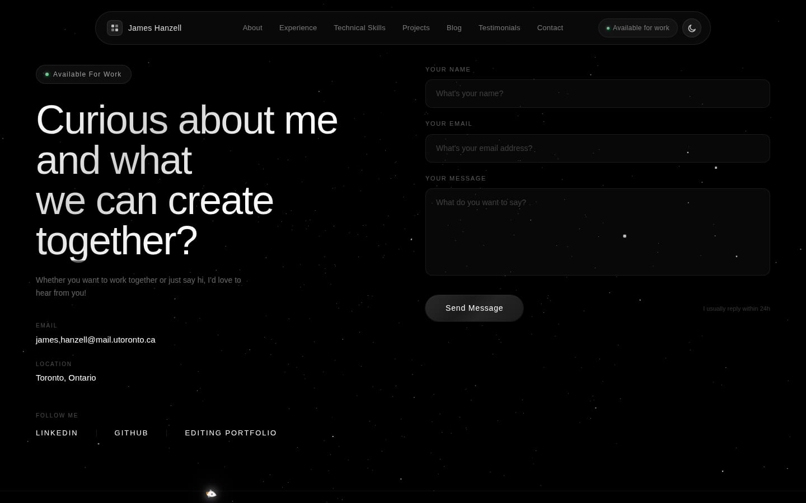

### Light mode
The sun/moon button in the navbar switches themes, and the choice is remembered. The starfield fades out in light mode.

<table>
  <tr>
    <td>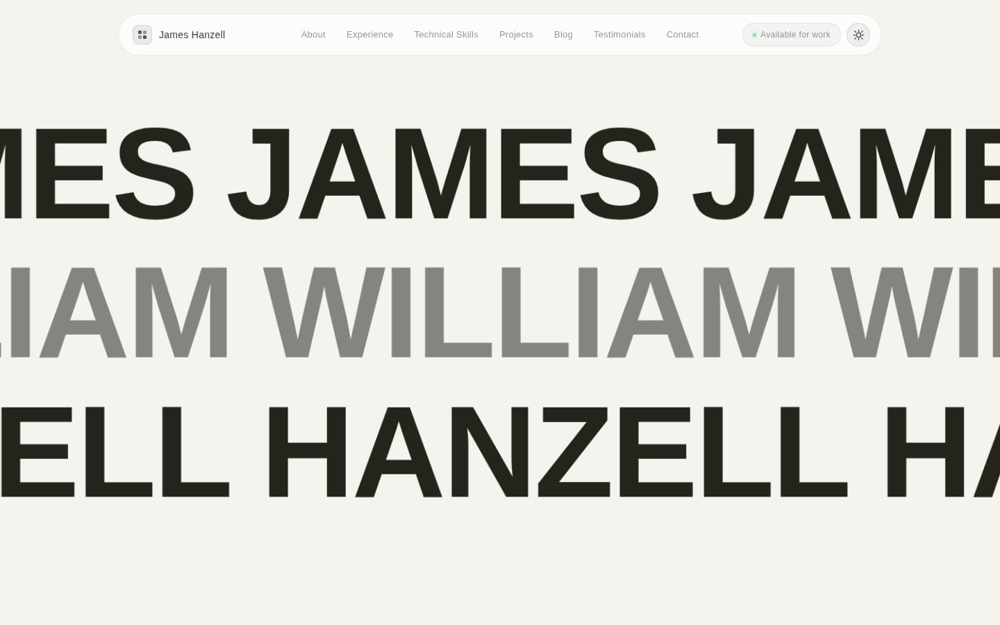</td>
    <td>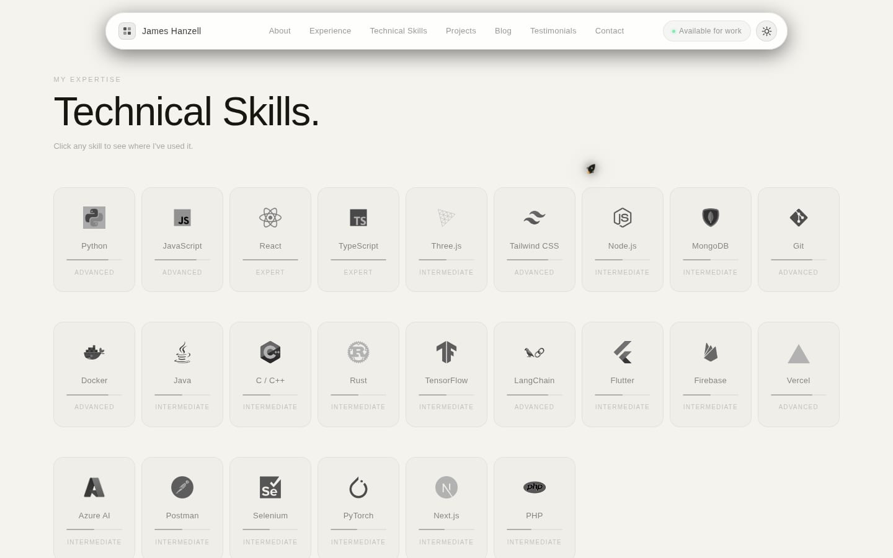</td>
  </tr>
</table>

## ✨ Features

- **Floating pill navbar** with section links, an "Available for work" badge and the theme toggle
- **Smooth scrolling** with Lenis and GSAP ScrollTrigger: pinned sections, scrubbed text reveals and a rocket that flies along a curved path down the page
- **Starfield background** rendered with React Three Fiber (dark mode)
- **Custom cursor** with hover states
- **Synthesized UI sounds** for clicks and navigation, generated with the Web Audio API
- **Performance and accessibility**: the 3D scene and flight path mount only after the loader finishes; code-split bundles, gzip/brotli compression, optimized images, SEO meta tags, keyboard support and a skip-to-content link

## 🛠️ Tech Stack

- **React 18 + Vite**: UI and build tooling
- **GSAP + ScrollTrigger**: scroll-driven animation
- **Lenis**: smooth scrolling
- **Framer Motion**: loader, cursor and blog transitions
- **Three.js / React Three Fiber**: starfield background
- **Tailwind CSS**: styling
- **EmailJS**: contact form delivery
- **react-parallax-tilt**: tilt effect on project cards

## 📦 Getting Started

```bash
git clone https://github.com/Eternal128/Personal-Portfolio.git
cd Personal-Portfolio
npm install --legacy-peer-deps
```

Create a `.env` file in the project root for the contact form:

```env
VITE_APP_EMAILJS_SERVICE_ID=your_service_id
VITE_APP_EMAILJS_TEMPLATE_ID=your_template_id
VITE_APP_EMAILJS_PUBLIC_KEY=your_public_key
```

Then run:

| Command           | Description                       |
| ----------------- | --------------------------------- |
| `npm run dev`     | Start the dev server              |
| `npm run build`   | Production build into `dist/`     |
| `npm run preview` | Preview the production build      |
| `npm run lint`    | Lint the project with ESLint      |

## 📁 Project Structure

```
src/
├── assets/              # Images, icons, loader and blog images
├── components/
│   ├── blog/            # Interactive blog widgets
│   ├── canvas/          # Three.js starfield
│   ├── Loader.jsx
│   ├── Navbar.jsx
│   ├── Hero.jsx
│   ├── About.jsx
│   ├── Experience.jsx
│   ├── Tech.jsx
│   ├── Works.jsx
│   ├── BlogSection.jsx
│   ├── Blog.jsx
│   ├── Feedbacks.jsx    # Testimonials
│   ├── End.jsx          # Contact form and footer
│   ├── FlightPath.jsx
│   └── CustomCursor.jsx
├── constants/           # Site content and blog posts
├── context/             # Theme, sound and Lenis providers
├── hooks/
├── utils/
├── App.jsx
└── main.jsx
docs/screenshots/        # Images used in this README
scripts/
└── optimize-loader-images.mjs
```

Site content (experience, projects, tech, testimonials) lives in `src/constants/index.js`, and blog posts in `src/constants/posts.js`.

## 🚀 Deployment

Deployed on Vercel. Add the EmailJS variables above to the project's environment variables.

## 📄 License

Licensed under the GNU GPL v3. See [LICENSE](LICENSE).

## 📧 Contact

**James William Hanzell**
- Email: james.hanzell@mail.utoronto.ca
- LinkedIn: [james-william-hanzell](https://www.linkedin.com/in/james-william-hanzell/)
- GitHub: [@Eternal128](https://github.com/Eternal128)
